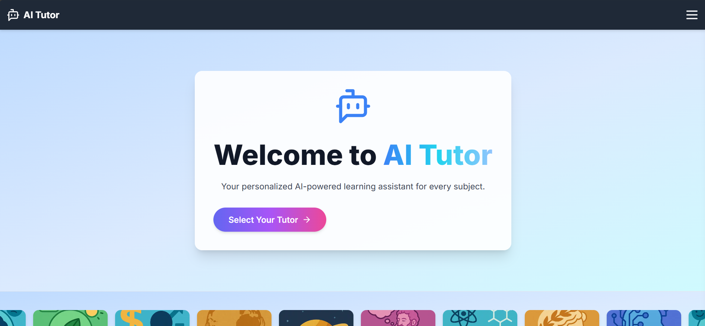
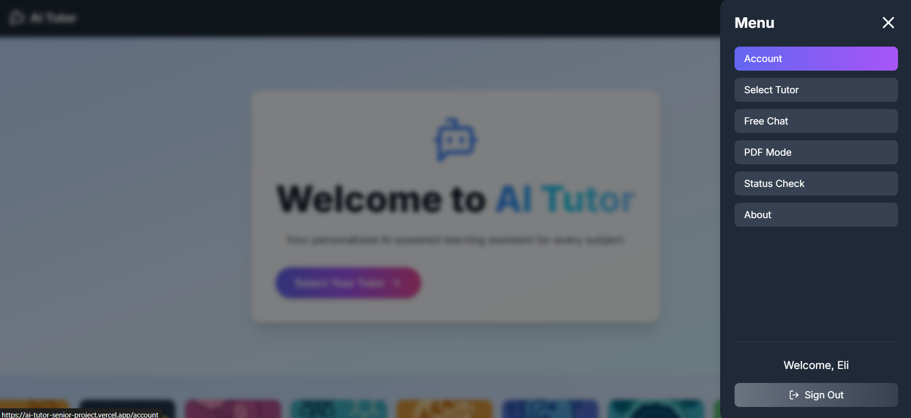
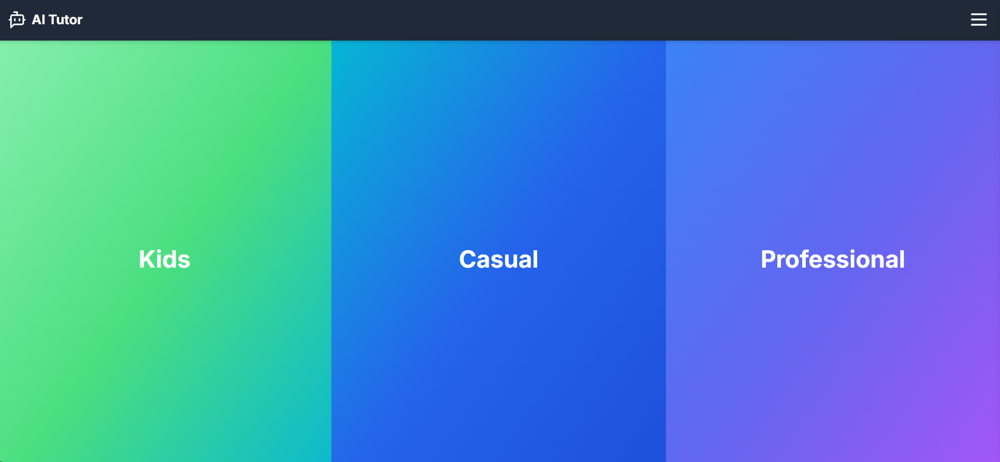
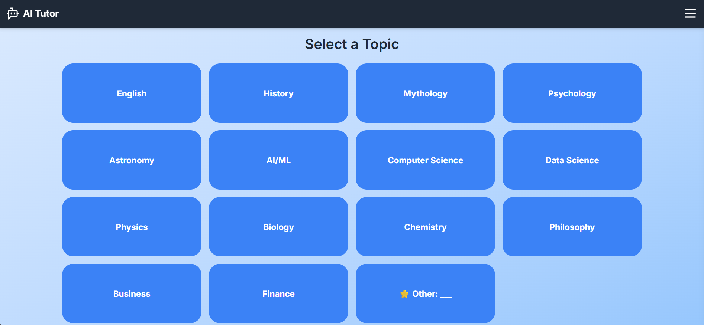
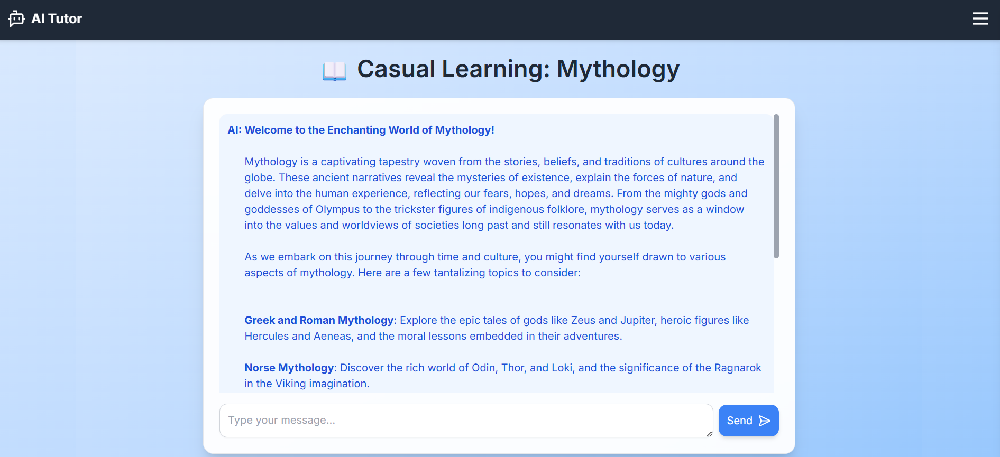
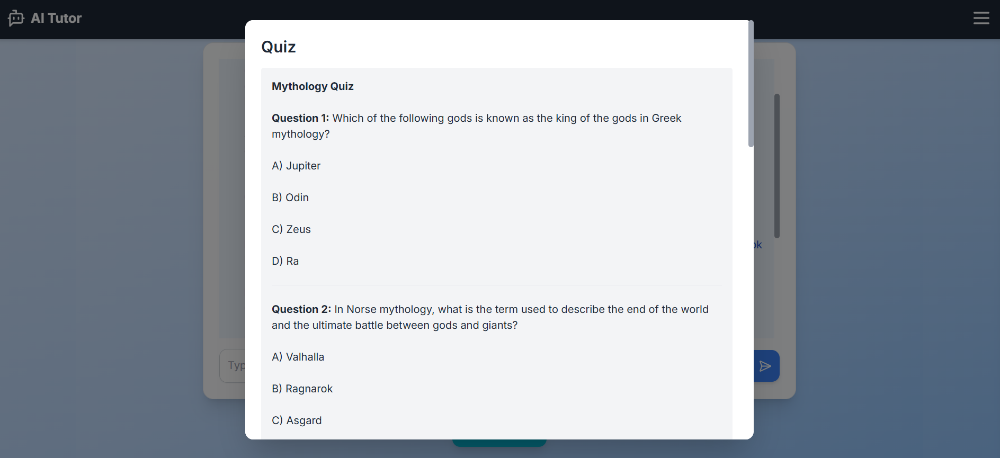
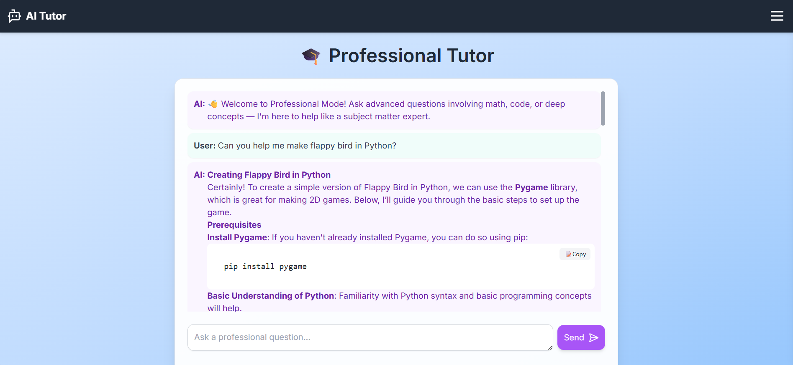
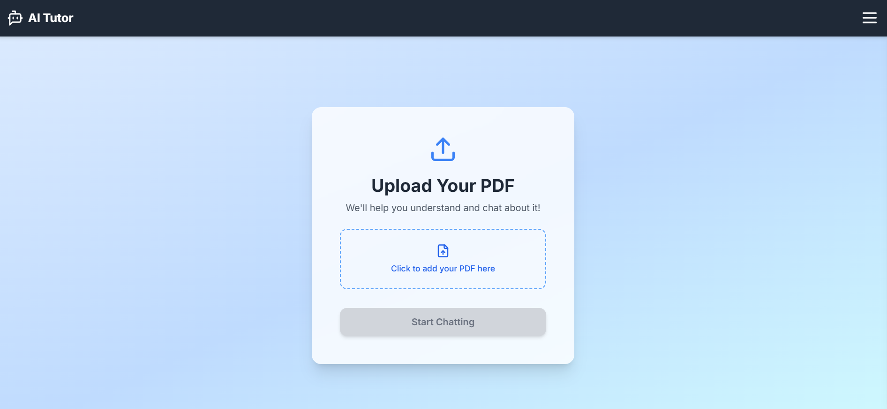

# 🧠 AI Tutor — Your Personalized Learning Assistant


## 🎉 Live on Vercel  
👉 [Visit AI Tutor!](https://ai-tutor-senior-project.vercel.app/)

---

## 📘 Overview

**AI Tutor** is an intelligent, full-stack tutoring platform designed to deliver personalized learning experiences for users of all ages and skill levels. Whether you’re a student, a professional, or just curious, AI Tutor helps you explore topics, test your knowledge, and track your progress — all with an engaging, interactive interface.

Developed as my **Senior Capstone Project** in Computer Science, this application combines Generative AI with an intuitive web-based design to deliever a unique and inspiring user experience.

---

## ✨ Features

- 🧑‍🏫 **Subject-Based Tutoring** – Learn by choosing from curated topic categories (e.g., Coding, Mythology, Astronomy).
- 📝 **Interactive Quizzes** – After each session, receive a custom quiz based on your conversation.
- 📄 **PDF Chat Mode** – Upload PDFs and ask questions about the contents directly.
- 💬 **Free Chat Mode** – Open-ended conversation with the AI on any topic.
- 👩‍💻 **Professional Mode** – Supports Markdown, LaTeX, and code formatting for technical users.
- 🏆 **User Stats & Badges** – Track your progress through usage data and earn badges for milestones.
- 🔐 **Secure Auth + API Limits** – Supabase Auth, protected routes, and a daily request cap for each user.

---

## 🖼️ Screenshots

| Homepage | Menu | Account Stats |
|----------|-----------|----------------|
|  |  |  |

| Tutors | Topics | Chat |
|----------|-----------|----------------|
|  |  |  |


| Quiz | Professional | PDF |
|----------|-----------|----------------|
|  |  |  |


---

## 🛠 Tech Stack

**Frontend:**
- [Next.js](https://nextjs.org/)
- [Tailwind CSS](https://tailwindcss.com/)
- [TypeScript](https://www.typescriptlang.org/)
- [Lucide Icons](https://lucide.dev/)

**Backend:**
- [FastAPI](https://fastapi.tiangolo.com/)
- [LangChain](https://www.langchain.com/)
- [OpenAI API](https://platform.openai.com/)

**Storage & Auth:**
- [Supabase](https://supabase.com/) (PostgreSQL, Row-Level Security, Auth)

**Document Parsing:**
- PyMuPDF + FAISS for PDF vector search

**Deployment:**
- [Vercel](https://vercel.com/) (Frontend)
- [Render](https://render.com/) (Python API)

---

## 🧪 Getting Started

### 1. Clone the Repository

```bash
git clone https://github.com/ECampbell37/AI_Tutor_SeniorProject.git
cd AI_Tutor_SeniorProject
```

### 2. Install Dependencies

```bash
# Frontend
cd app
npm install

# Backend
cd ../python-api
pip install -r requirements.txt
```

### 3. Environment Setup

Create `.env.local` in the `app` folder and `.env` in `python-api`.

**Example: `app/.env.local`**
```
NEXT_PUBLIC_SUPABASE_URL=your_supabase_url
NEXT_PUBLIC_SUPABASE_ANON_KEY=your_public_key
OPENAI_API_KEY=your_openai_key
```

**Example: `python-api/.env`**
```
OPENAI_API_KEY=your_openai_key
```

### 4. Run Locally

```bash
# Terminal 1 - Frontend
cd app
npm run dev

# Terminal 2 - Backend
cd python-api
uvicorn main:app --reload
```

---

## 📊 User Progress & Badges

Track your learning journey with:

- ✅ Number of logins  
- ✅ Topics explored  
- ✅ Quizzes taken

Badges are automatically awarded based on activity milestones — including your first quiz, getting a perfect score, exploring topics, and more!

---

## 🤝 Author

🏆 Made by [Elijah Campbell-Ihim](https://github.com/ECampbell37)  
🎓 CMPS-450 Senior Project — Spring 2025
